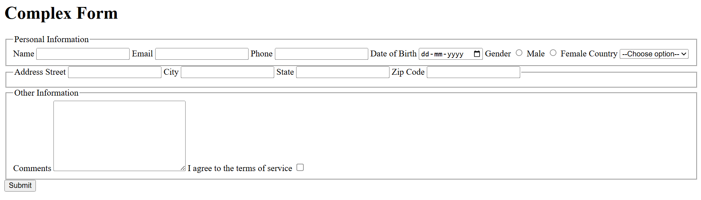

# 📘 Complex HTML Form

This project is a practice exercise to build a **complex multi-section HTML form** using fieldsets, text inputs, dropdowns, radio buttons, checkboxes, and a textarea.

## 🔗 Live Demo
https://complex-form-gamma.vercel.app/

## 🎯 What I Practiced
- Multi-section forms using `<fieldset>` and `<legend>`
- Input types: text, email, tel, date
- Gender selection with radio buttons
- Country dropdown
- Address fields (street, city, state, zip)
- Comments textarea
- Terms & Conditions checkbox
- Form structure and layout

## 📸 Output Screenshot

