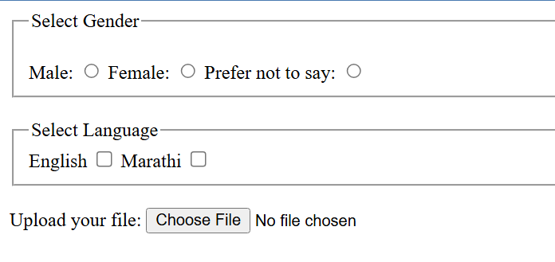

# 📘 HTML Form Practice

This project contains a simple practice page using HTML form elements.  
It includes gender selection, language checkboxes, and a file upload input.

## 🔗 Live Demo  
[Check out → Live Demo](https://form-practice-six.vercel.app/)

## 🎯 What I Practiced
- Using `<fieldset>` and `<legend>` to group form controls  
- Creating radio buttons (single-select)  
- Creating checkboxes (multi-select)  
- Adding a file upload input  
- Basic form structure and labels

## 📸 Output Screenshot

