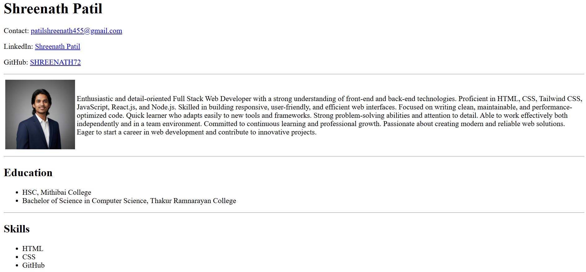

# Shreenath Patil - HTML Resume
This is a personal HTML-based resume project showcasing my profile, education, skills, and projects. It is built using **HTML** and designed to be simple, clean, and professional.

## 🔗 Live Demo
https://html-resume-3am9o2emk-dummy22004-commits-projects.vercel.app/

## 🎯 What I Practiced
- Structuring a personal resume using semantic HTML (`
`, `<section>`, `<header>`, `<footer>`)  
- Adding images, links, and contact info (`mailto:`, LinkedIn, GitHub)  
- Using tables for layout and lists (`<ul>`, `<li>`)  
- Highlighting text with `<b>`  
- Creating multi-section forms with `<fieldset>` and `<legend>`  
- Using various input types, radio buttons, dropdowns, textareas, and checkboxes  
- Organizing projects with descriptions, hosted links, and GitHub links  

## 📸 Output Screenshot

