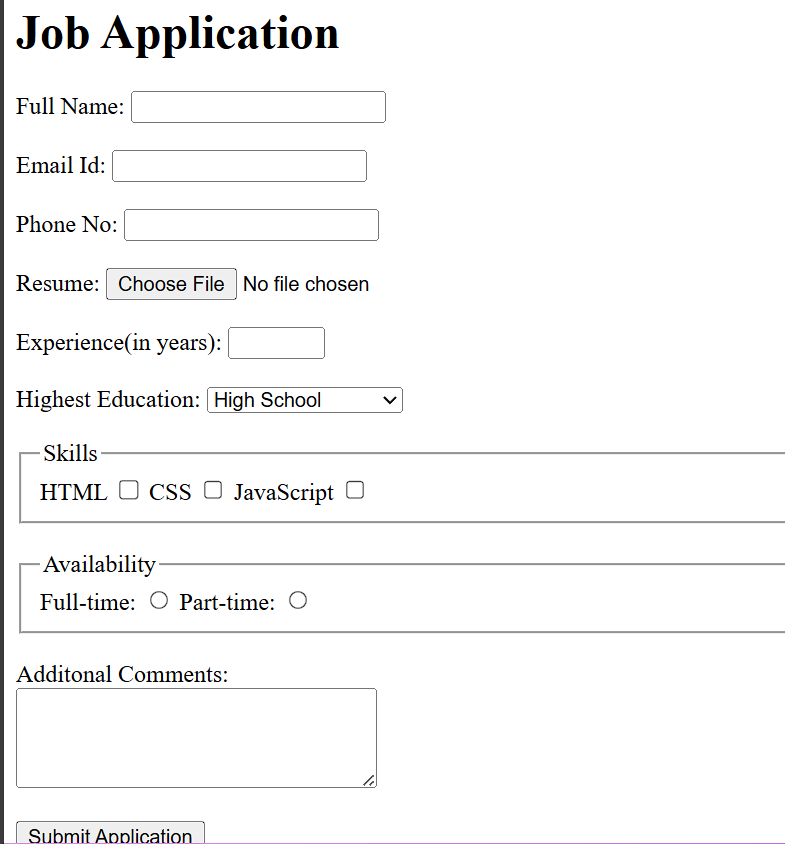

# 📘 Job Application Form (HTML Practice)

This project is a simple **Job Application Form** created using essential HTML form elements.  
It includes text fields, file upload, dropdowns, checkboxes, radio buttons, textarea, and a submit button.

## 🔗 Live Demo  
[Check out → Live Demo](https://harlequin-kimberley-44.tiiny.site)

## 🎯 What I Practiced
- Creating structured HTML forms  
- Using input types: text, email, tel, file, number  
- Dropdown menu with `<select>` and `<option>`  
- Grouping related inputs using `<fieldset>` and `<legend>`  
- Checkboxes and radio button implementation  
- Adding a textarea for longer answers  
- Form layout and usability basics  

## 📂 Features of the Form
- Full Name, Email, Phone fields  
- Resume upload option  
- Experience in years (0–50)  
- Highest education selection  
- Skill selection (HTML, CSS, JavaScript)  
- Availability choice (Full-time / Part-time)  
- Additional comments box  
- Submit button  

## 📸 Output Screenshot

