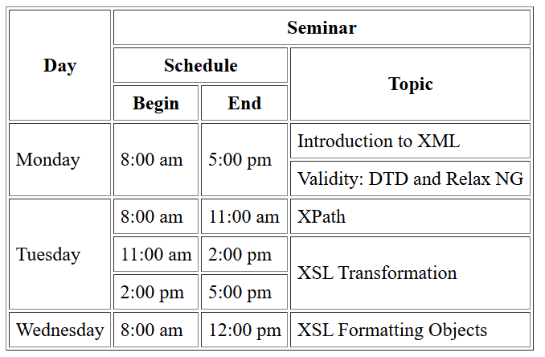
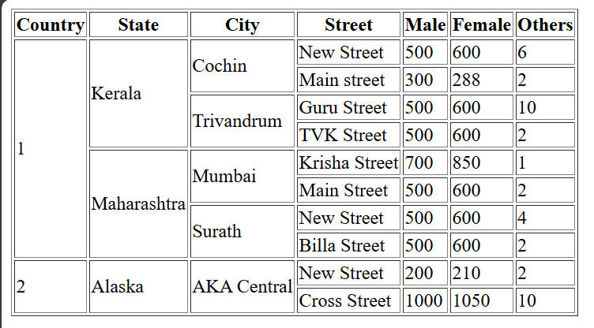

# 📘 HTML Table Practice

This folder contains two HTML table practice files:

1. **Seminar Schedule Table** – uses rowspan, colspan, and table headers.  
2. **Country–State–City Population Table** – shows hierarchical data using multiple rowspan values.

## 🎯 What I Practiced
- Complex table structure  
- `<thead>` and `<tbody>` usage  
- Merging cells (rowspan & colspan)  
- Presenting real-world tabular data

## 📸 Output Screenshots

  

